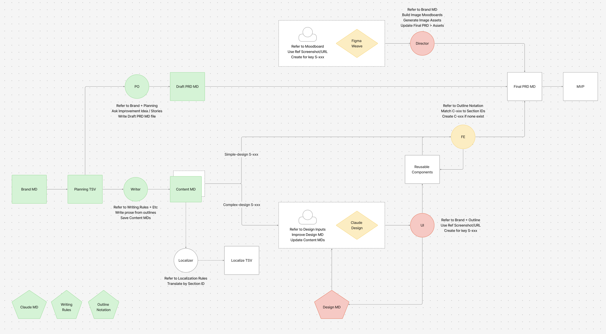

# SHER Web Store

Headless Shopify storefront for the **SHER** fashion brand — [sherbrand.co](https://sherbrand.co).
Built with Next.js 15 (App Router) and the Shopify Storefront API.

## About this repo

This is the planning and draft workspace for the SHER web store.
Every file here is a draft. We fine-tune it here, then copy it to the live SherShop repo.
Nothing here is live code yet.

The full engineering handbook is in **[claude-repo.md](claude-repo.md)** — coding, design, writing, and stack rules, plus the source-of-truth index. It becomes `CLAUDE.md` at the real repo root.

## Tech stack

- Next.js 15 (App Router)
- TypeScript (strict mode)
- Tailwind CSS
- Shopify Storefront API (GraphQL)
- Shopify hosted checkout + customer accounts
- Vercel deployment

## How the app is built

A few of the core rules (see `claude-repo.md` for the rest):

- **Server Components first.** Every component is a Server Component. Add `'use client'` only for interactive parts — cart buttons, filters, quantity selectors, the mobile menu.
- **One fetch wrapper.** All Storefront API calls go through a single `shopifyFetch()`. Queries and mutations live in `/lib/shopify/`.
- **Cart.** The Shopify cart ID lives in a cookie, created on the first add-to-cart. Cart changes use Server Actions. Checkout redirects to Shopify hosted checkout.
- **SEO.** Every product and collection page uses `generateMetadata`. Every product page ships JSON-LD `Product` schema. No client-only rendering for content that needs to be indexed.
- **Performance.** `next/image` with Shopify CDN URLs. Async sections wrapped in `<Suspense>` with skeletons. Minimal client JavaScript.
- **Style.** Tailwind only. Named exports only. Absolute imports from `@/`. No `any`.

## Files

Each file owns one job. Do not repeat its content in another file.

| File | Owns |
|------|------|
| `claude-repo.md` | Coding, design, writing, and stack rules + the source-of-truth index |
| `prd-shershop-v3.md` | The build spec — features, data, screens, behaviour, build steps (highest version is live) |
| `planning-shershop.tsv` | Versioned plan — pages (URLs, SEO, keywords, hreflang), components, and features |
| `brand-sher.md` | Brand voice, audience, positioning, and references |
| `writing-rules.md` | Writing standards — voice, SEO, GEO, banned phrases |
| `outline-notation.md` | The outline notation — the layout grammar used in plans and content |
| `design-input.md` | Design inputs and direction |
| `SKILL-po.md` | PO role — drafts the PRD |
| `SKILL-ui.md` | UI role — harvests design tokens into `DESIGN.md`, reconciles screen copy |
| `SKILL-writer.md` | Writer role — writes content from outlines |
| `SKILL-fe.md` | FE role — builds reusable components |
| `Ref UI/` | Design reference — mockups, moodboards, screenshots |
| `Legacy/` | Set-aside drafts. Not a source of truth — ignore. |

## Sources of truth

Read the right file before you build or write:

- Features, screens, scope → the latest `prd-shershop-v<n>.md`
- Brand voice, audience, positioning → `brand-sher.md`
- Content writing standards → `writing-rules.md`
- What to build, by version → `planning-shershop.tsv`
- Outline / layout grammar → `outline-notation.md`

The plan is forward-looking; the PRD is the historical source of truth and the ID authority. See `claude-repo.md` for the full conflict rules between the two.

## On port (when moving to the live repo)

- `claude-repo.md` → `CLAUDE.md` at the repo root.
- Each `SKILL-*.md` → `SKILL.md` in its own folder under `.claude/skills/`.
- Every other file keeps its name.
